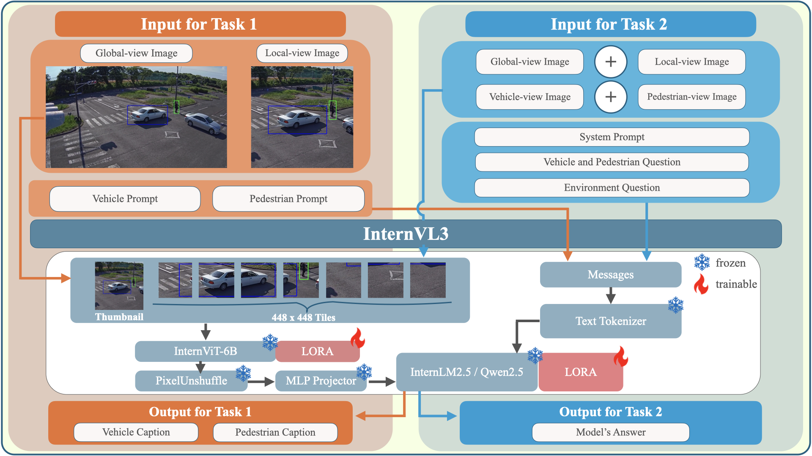

# TrafficInternVL: Spatially-Guided Fine-Tuning with Caption Refinement for Fine-Grained Traffic Safety Captioning and Visual Question Answering

**📄 Paper Accepted at ICCV 2025 Workshop**

**Authors:** Sasin Phimsiri¹*†, Sarut Sunpawatr¹*, Riu Cherdchusakulchai²*, Pornprom Kiawjak³*, Teepakorn Tosawadi¹*, Suchat Tungjitnob¹‡, Visarut Trairattanapa¹‡, Supawit Vatathanavaro¹‡, Wasu Kudisthalert¹‡, Chaitat Utintu¹, Worawit Saetan¹, Nathamon Kongsawat¹, Phawat Borisuitsawat¹, Kasisdis Mahakijdechachai¹, Nitipan Su-Inn¹, Ek Thamwiwatthana¹§, Vasin Suttichaya⁴§

**Affiliations:**
- ¹AI and Robotics Ventures
- ²Carnegie Mellon University  
- ³King Mongkut's Institute of Technology Ladkrabang
- ⁴Mahidol University

*These authors contributed equally  
†Corresponding Author: sasinp@arv.co.th | sasin.phimsiri@gmail.com  
‡Co-Author  
§Senior Author

🏆 **4th Place in AI City Challenge 2025 Track 2**

TrafficInternVL provides a complete pipeline for traffic scene understanding: data prep (caption + VQA), training, export, and inference.

## Architecture



## Requirements
- Conda environment with Python 3.10 (recommended)
- CUDA 12.2 installed (driver/toolkit) for training
- Install dependencies with `pip install -r requirements.txt`
- Ensure dataset is downloaded locally (see below)
- Hardware: peak GPU memory ~86.5 GB (reduce batch/grad-accum if less)

## Project Structure

```
TrafficInternVL/
├── data-preparation/
│   ├── task1/
│   │   ├── data/
│   │   │   ├── BDD_PC_5k/
│   │   │   │   ├── annotations/
│   │   │   │   │   ├── bbox_annotated/
│   │   │   │   │   ├── bbox_generated/
│   │   │   │   │   └── caption/
│   │   │   │   └── videos/
│   │   │   ├── WTS/
│   │   │   │   ├── annotations/
│   │   │   │   │   ├── bbox_annotated/
│   │   │   │   │   ├── bbox_generated/
│   │   │   │   │   └── caption/
│   │   │   │   └── videos/
│   │   │   ├── SubTask1-Caption/
│   │   │   │   ├── WTS_DATASET_PUBLIC_TEST/
│   │   │   │   └── WTS_DATASET_PUBLIC_TEST_BBOX/
│   │   │   ├── SubTask2-VQA/
│   │   │   │   └── WTS_VQA_PUBLIC_TEST.json
│   │   │   └── wts_dataset_zip/
│   │   └── ... # python and shell scripts
│   └── task2/
│       ├── processed_data_subtask2_best_view/
│       │   ├── images/
│       │   │   ├── train/
│       │   │   └── test/
│       │   ├── wts_dataset_train_subtask2_best_view.jsonl
│       │   └── wts_dataset_test_subtask2_best_view.jsonl
│       └── ... # python and shell scripts
├── models-training/
│   └── data/
└── ... # other project files
```

## 1) Setup
```bash
cd <YOUR_PROJECT_PATH>/TrafficInternVL
conda create -n trafficinternvl python=3.10 -y
conda activate trafficinternvl
pip install -r requirements.txt
# Ensure your PyTorch build matches CUDA 12.2
```

## 2) Data Download & Paths
- Download WTS dataset: <a href="https://woven-visionai.github.io/wts-dataset-homepage/" target="_blank" rel="noopener noreferrer">WTS: Woven Traffic Safety Dataset</a>
- Place datasets under:
  - `data-preparation/task1/data/`
- Update paths in scripts to your local project path:
```bash
# Example (task1 scripts)
root="<YOUR_PROJECT_PATH>/TrafficInternVL/data-preparation/task1/data/"
save_folder="<YOUR_PROJECT_PATH>/TrafficInternVL/data-preparation/task1/processed_anno/"
```

## 3) Task 1 — Caption Data
- Prepare training data:
```bash
cd data-preparation/task1
# Edit paths in prepare_data_train.sh first
./prepare_data_train.sh   # outputs: wts_bdd_local_train.json
```
- Convert to InternVL format and copy to training dir:
```bash
cd processed_anno/internvl_format/
# Edit paths in final_dataset.sh and update_prompt.sh if needed
./final_dataset.sh
./update_prompt.sh        # outputs: final_local_train_dataset.json
cp final_local_train_dataset.json ../../models-training/data/
```
- Prepare test data (optional):
```bash
cd data-preparation/task1
# Edit test_root & generate_test_frames_path in prepare_data_test.sh
./prepare_data_test.sh
```

## 4) Task 2 — VQA Data
- Prerequisite: Task 1 data present in `data-preparation/task1/data/`
- Training split:
```bash
cd data-preparation/task2
bash run_prepare_data_train_subtask2_best_view.sh
# outputs:
# - processed_data_subtask2_best_view/wts_dataset_train_subtask2_best_view.jsonl
# - processed_data_subtask2_best_view/images/train/
```
- Test split:
```bash
cd data-preparation/task2
bash run_prepare_data_test_subtask2_best_view.sh
# outputs:
# - processed_data_subtask2_best_view/wts_dataset_test_subtask2_best_view.jsonl
# - processed_data_subtask2_best_view/images/test/
```

- Quick verification:
```bash
wc -l processed_data_subtask2_best_view/*.jsonl
find processed_data_subtask2_best_view/images -name "*.jpg" | wc -l
head -n 1 processed_data_subtask2_best_view/wts_dataset_train_subtask2_best_view.jsonl | python3 -m json.tool
```

## 5) Train (Optional - Skip if using pre-trained models)

### Option A: Train Your Own Model
```bash
cd models-training
# Edit paths in setup_environment.sh if needed
./setup_environment.sh

# Edit paths/options in train.sh if needed
./train.sh
```
Notes:
- Default dataset name is set in `models-training/data/dataset_info.json` (should be `aicity_local_dataset`).
- Default model: `OpenGVLab/InternVL3-8B-hf` with LoRA rank 64.
- Default output dir: `model/InternVL-38B/r8-task1-github-test`.

### Option B: Use Pre-trained Models from Hugging Face

**For Task 1 (Video Description):**
```bash
# Download the pre-trained model for Task 1
huggingface-cli download parksarut/InternVL-38B-Video-Description --local-dir ./models-training/exported_models/task1_model
```
🔗 **Model Repository**: [parksarut/InternVL-38B-Video-Description](https://huggingface.co/parksarut/InternVL-38B-Video-Description) <mcreference link="https://huggingface.co/parksarut/InternVL-38B-Video-Description/tree/main" index="0">0</mcreference>

**For Task 2 (Question Answering):**
```bash
# Download the pre-trained model for Task 2 (specific subfolder)
huggingface-cli download ParkkyOk/InternVL-38B-QA InternVL-38B-AICity-Simple-Merged --local-dir ./models-training/exported_models/task2_model
```
🔗 **Model Repository**: [ParkkyOk/InternVL-38B-QA](https://huggingface.co/ParkkyOk/InternVL-38B-QA/tree/main/InternVL-38B-AICity-Simple-Merged) <mcreference link="https://huggingface.co/ParkkyOk/InternVL-38B-QA/tree/main/InternVL-38B-AICity-Simple-Merged" index="1">1</mcreference>

**Note:** If you choose Option B, you can skip the training step and proceed directly to inference using the downloaded models.

## 6) Export & Inference

### If you trained your own model (Option A):
- Export merged model (base + LoRA):
```bash
cd models-training
# In export.sh set:
# --adapter_name_or_path=model/InternVL-38B/r8-task1-github-test
# --export_dir=./exported_models/your_exported_model
./export.sh
```

### If you downloaded pre-trained models (Option B):
You can skip the export step and proceed directly to inference using the downloaded models.

### Inference:

**For Task 1 (Video Description):**
```bash
cd models-training
# In inference_image_input.sh set:
# --model_path=./exported_models/task1_model (if using pre-trained) OR ./exported_models/your_exported_model (if trained yourself)
# --test_data_dir=<YOUR_PROJECT_PATH>/TrafficInternVL/data-preparation/task1/data/generate_test_frames/bbox_local
./inference_image_input.sh
```
 
**For Task 2 (Question Answering):**
```bash
cd models-training
# In inference script set:
# --model_path=./exported_models/task2_model (if using pre-trained) OR ./exported_models/your_exported_model (if trained yourself)
# Use appropriate inference script for Task 2
```

## Configuration Checklist
- Task 1 scripts:
  - `root`, `save_folder`
  - `test_root`, `generate_test_frames_path` in `prepare_data_test.sh`
- Task 2 scripts:
  - Verify `data-preparation/task1/data/` exists
  - Check `DATA_ROOT`, `TEST_VIDEOS_DIR`, `TEST_BBOX_DIR`, `VQA_TEST_FILE`, `OUTPUT_ROOT`
- Training scripts:
  - `output_dir` in `train.sh`
  - Dataset in `models-training/data/dataset_info.json`
- Export & inference scripts:
  - `--adapter_name_or_path`, `--export_dir`, `--model_path`, `--test_data_dir`

## Key Scripts
- Task 1 (Caption):
  - `data-preparation/task1/prepare_data_train.sh`
  - `data-preparation/task1/prepare_data_test.sh`
  - `data-preparation/task1/processed_anno/internvl_format/final_dataset.sh`
  - `data-preparation/task1/processed_anno/internvl_format/update_prompt.sh`
- Task 2 (VQA Best View):
  - `data-preparation/task2/run_prepare_data_train_subtask2_best_view.sh`
  - `data-preparation/task2/run_prepare_data_test_subtask2_best_view.sh`
  - `data-preparation/task2/prepare_data_train_subtask2_best_view.py`
  - `data-preparation/task2/prepare_data_test_subtask2_best_view.py`
- Training & Inference:
  - `models-training/setup_environment.sh`
  - `models-training/train.sh`
  - `models-training/export.sh`
  - `models-training/inference_image_input.sh`

## Troubleshooting (Quick)
- Paths: most errors are path-related—double-check the variables listed above.
- Environment: ensure your venv is active and `pip install -r requirements.txt` succeeded.
- Task 2 performance: reduce `NUM_WORKERS` if running out of memory.
- Terminal: use `bash` (not `sh`) for colored output and echo formatting.

## Reference
- AI City Challenge — <a href="https://www.aicitychallenge.org/" target="_blank" rel="noopener noreferrer">Official Website</a>
- CityLLaVA: Efficient Fine-Tuning for VLMs in City Scenario — <a href="https://doi.org/10.48550/arXiv.2405.03194" target="_blank" rel="noopener noreferrer">Paper</a> · <a href="https://github.com/alibaba/AICITY2024_Track2_AliOpenTrek_CityLLaVA" target="_blank" rel="noopener noreferrer">Code</a>
- LLaMA-Factory — Unified Efficient Fine-Tuning of 100+ LLMs & VLMs: <a href="https://github.com/hiyouga/LLaMA-Factory" target="_blank" rel="noopener noreferrer">GitHub</a>